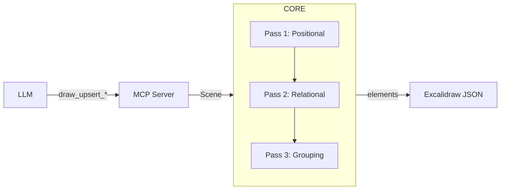
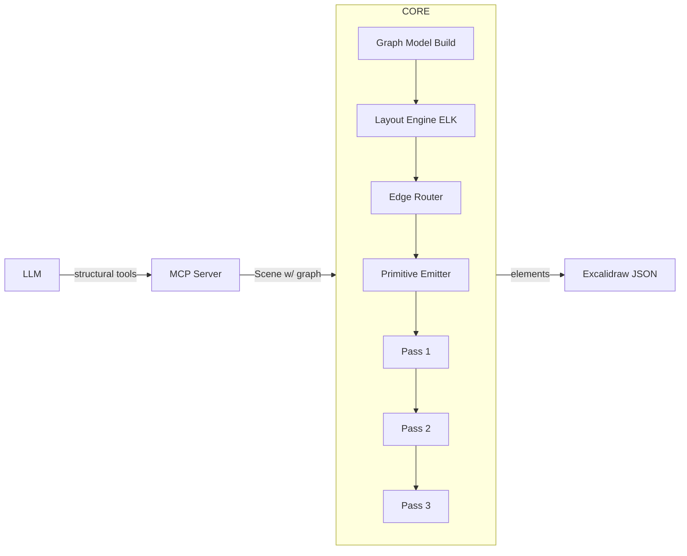
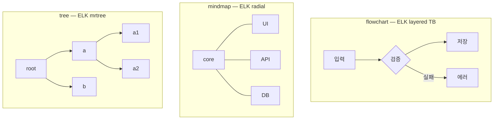
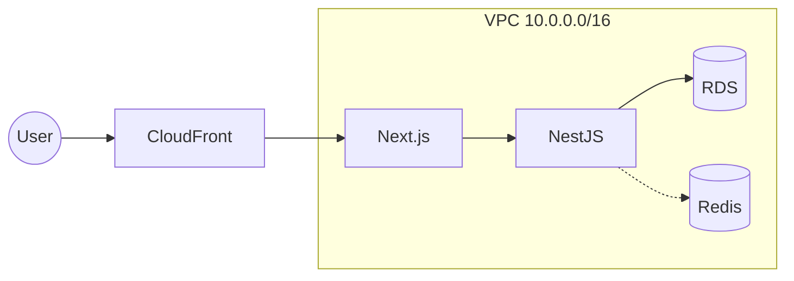
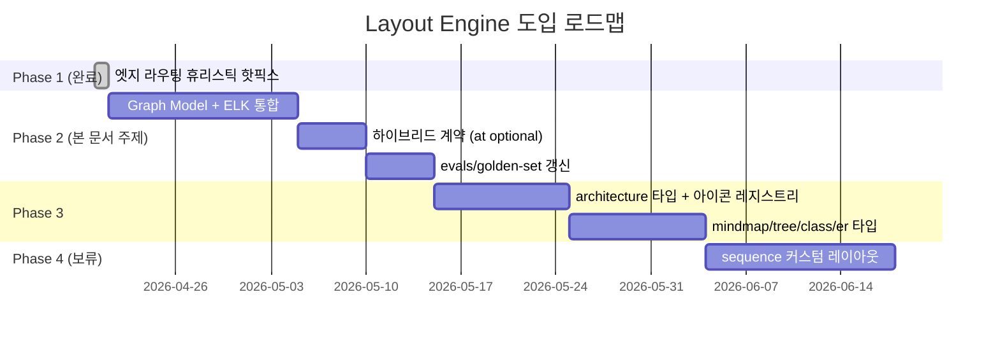

<!-- status: DRAFT / 논의·합의용 초안 -->
<!-- owner: TBD -->
<!-- phase: Phase 2 (ELK 통합 + 하이브리드 계약) 주제 -->

# 11. Layout Engine

> **이 문서는 설계 제안서(draft)다.** 확정 API가 아니다. 사용자가 읽고 결정을 내리는 게 목표이며, 모든 인터페이스·알고리즘 선택은 "검토 후 확정" 상태다. 애매한 부분은 §10 오픈 퀘스천에 모았다.

## 관련 문서

- [`00-project-overview.md`](./00-project-overview.md) — MVP 범위
- [`01-architecture.md`](./01-architecture.md) — 3-패키지 구조. Layout Engine은 `@drawcast/core` 내부 레이어로 들어갈 예정
- [`02-l2-primitives.md`](./02-l2-primitives.md) — 본 문서의 스키마 변경 대상
- [`03-compile-pipeline.md`](./03-compile-pipeline.md) — 현 3-pass compile. Layout pass를 그 사이에 끼울지, 앞에 둘지가 §4의 주제
- [`05-mcp-server.md`](./05-mcp-server.md) — MCP tool 스키마 변경안(§5)
- [`10-development-roadmap.md`](./10-development-roadmap.md) — Phase 7 "L3 Graph model + 자동 레이아웃" 항목이 본 문서의 씨앗

---

## 1. 배경과 동기

### 1.1 현 구조의 한계

현재 drawcast의 LLM(`claude -p ...`)은 `draw_upsert_box`·`draw_upsert_edge` 호출마다 **스스로 좌표를 계산**해서 `at: [x, y]` 를 채운다. `drawUpsertBox` 의 zod 스키마에서 `at` 은 `required` 이며, `size`도 `fit='fixed'` 일 때 필수다 (`packages/mcp-server/src/tools/drawUpsertBox.ts:109`).

```ts
// drawUpsertBox.ts:37-54 (요약)
export const drawUpsertBoxInputSchema = z.object({
  id: z.string().min(1),
  at: PointSchema,          // ← 현재 필수
  // ...
  size: SizeSchema.optional(),
  // ...
});
```

이 계약은 **LLM이 공간 추론까지 떠안는다**는 뜻이다. 결과적으로:

| 증상 | 원인 | 비용 |
|---|---|---|
| 노드 수가 늘수록 배치 품질 저하 | LLM의 2D 공간 추론은 noisy | 사용자 만족도 ↓ |
| 다이어그램 타입마다 배치 규칙 프롬프트 누적 | flowchart vs tree vs architecture가 모두 다름 | `system-prompt.md` 분량 폭증 |
| 엣지 라우팅이 노드 겹침/교차를 고려 못 함 | binding endpoint는 shape 경계 보정만 해줌 | 시각적 품질 ↓ |
| 동일 요청에 다른 결과 | LLM 응답의 stochasticity가 좌표에 그대로 노출 | 예측 불가능 |

### 1.2 증상: 엣지 라우팅 이상 동작

Phase 1에서 `packages/core/src/emit/connector.ts` 에 **포트 인지 elbow 라우팅**을 도입했다 (cardinal N/E/S/W 포트 선택 + 방향 인지 꺾임). 이전에는 중심 벡터 기반 경계 교점이 코너 근처에 찍혀 elbow가 어색한 "위로 꺾임" 경로를 만들었다. Phase 1 이후 이 증상은 해결됐다.

다만 Phase 1은 근본 해결이 아니다. `boundaryPoint`·`portPoint` 는 shape 경계까지만 안내할 뿐, **노드 사이 빈 공간을 지능적으로 통과**하거나 **다른 노드를 피해 돌아가는** 진짜 orthogonal routing은 아니다. LLM이 준 좌표가 노드 간격을 충분히 확보해주지 않으면 여전히 겹침·교차가 발생한다.

결국 이 또한 **upstream에서 좌표 품질이 낮기 때문에 drown되는 하위 증상**이다. 본 문서가 제안하는 레이아웃 엔진(§3)이 좌표 품질 자체를 올리면 엣지 라우팅은 훨씬 단순한 문제가 된다.

### 1.3 확장성 문제

`00-project-overview.md` 와 `10-development-roadmap.md` 의 Phase 7에 "L3 Graph model + 자동 레이아웃"이 예약돼 있지만, MVP에서는 의도적으로 미뤘다. 지금은 아키텍처 다이어그램(BE/FE/Redis/AWS 같은 구성도), 시퀀스 다이어그램, 마인드맵 등을 LLM 프롬프트만으로 흉내 내려 하면 다음이 필요하다:

- 타입별 배치 규칙 (mindmap은 radial, architecture는 layered 등)
- 타입별 엣지 스타일 (sync/async/data flow)
- 타입별 노드 아이콘 (AWS RDS, Redis, React 등)

이걸 프롬프트로 주입하면 `system-prompt.md` 는 수천 줄이 되고, 그래도 LLM이 매번 정확히 따를 보장이 없다.

### 1.4 결론

**"LLM이 좌표를 만든다"**를 포기하고, **"LLM은 구조를 선언하고 엔진이 좌표를 만든다"** 로 전환한다. 이것이 본 문서가 제안하는 방향이다.

---

## 2. 설계 원칙

### 2.1 구조 선언형 (semantic-first)

LLM 출력은 **"노드가 뭐고, 어떻게 이어져 있는가"** 만 표현한다. 좌표·크기는 엔진이 결정.

```
현 상태:
  LLM → [{ id: 'A', at: [100, 100] }, { id: 'B', at: [400, 100] }, ...]

제안:
  LLM → [{ id: 'A' }, { id: 'B' }, { edge: 'A → B' }]
  Engine → [{ id: 'A', at: [x_A, y_A] }, { id: 'B', at: [x_B, y_B] }, ...]
```

### 2.2 하이브리드 (LLM 오버라이드 허용)

LLM이 의도적으로 좌표/크기를 주면 **엔진은 그 의도를 존중**한다. 완전 자동이 아니라 **"기본은 자동, 명시하면 고정"**.

- `at` 미지정 → 엔진이 배치
- `at` 지정 → "이 노드는 여기 고정" 으로 엔진에 제약(constraint)으로 전달
- 부분 지정(일부만 `at` 있음) → 지정된 것들 기준으로 나머지 배치

이건 사용자가 수작업 편집 후 CLI에 "여기에 노드 하나 더 추가해줘" 라고 요청했을 때도 깨지지 않기 위한 안전장치다.

### 2.3 계층 분리

현 `03-compile-pipeline.md` 는 **(Primitive → Excalidraw element)** 가 한 덩어리다. 여기에 **Graph Model → Layout → Router → Primitive → Excalidraw** 로 층을 벌린다.

각 층은 단방향으로 아래 층에 의존하며, 상위 층 테스트는 하위 층 없이도 가능하도록 인터페이스로 분리.

### 2.4 결정적 렌더 (determinism)

동일 입력 → 동일 출력. ELK 자체는 결정적이지만, seed·tie-breaking 규칙을 고정해서 "LLM이 노드 순서를 다르게 주면 레이아웃이 흔들린다"를 방지한다.

- primitive insertion order가 ELK input에 일관되게 반영되도록 `SceneStore` 가 Map 대신 `Map + insertionOrder` 를 유지하거나, Graph Model 빌드 시 `id` 사전순 정렬 중 하나를 명시적으로 선택.
- **TBD**: insertion order vs id sort — §10 참조.

### 2.5 계약 안정성

하위 호환이 최우선이다. 기존 `at` 기반 입력은 **Phase 2 이후에도 무기한 지원**한다. "optional" 로 만들 뿐 제거하지 않는다.

---

## 3. 레이아웃 엔진 선택

### 3.1 후보 비교

| 엔진 | 알고리즘 | 환경 | 라이선스 | 번들 크기 | 엣지 라우팅 | Nested/Compound |
|---|---|---|---|---|---|---|
| **ELK.js (elkjs)** | layered, force, mrtree, radial, disco, stress, rectpacking 등 | 순수 JS + WASM | EPL-2.0 | ~300KB(min+gz, 순수 JS) / ~200KB(WASM 래퍼) | orthogonal, polyline, splines | ○ (compound graphs) |
| dagre | layered (Sugiyama) 전용 | 순수 JS | MIT | ~100KB | orthogonal만 | △ (subgraph 제한적) |
| Graphviz WASM (@hpcc-js/wasm) | dot, neato, fdp 등 | WASM | MIT | ~1-2MB | spline | ○ |
| cola.js (WebCoLa) | force-directed + constraint | 순수 JS | MIT | ~120KB | straight/spline | △ |

**엣지 라우팅 주**: 본 표의 "orthogonal" 은 단순한 L-shape 이상을 의미한다. ELK는 노드를 우회하는 real orthogonal routing을 내장한다.

### 3.2 ELK.js 선택 근거

1. **Mermaid v10+ 채택 선례**. 실전에서 LLM 생성 다이어그램을 다루는 가장 큰 사용자가 이미 ELK로 이동했다. 기대되는 사례·버그가 이미 공개돼 있다.
2. **알고리즘 다양성**. layered/force/mrtree/radial 등이 한 엔진 안에 있어서 **다이어그램 타입별로 ELK 옵션만 바꾸면** 되는 구조. 엔진 여러 개를 엮을 필요 없음.
3. **orthogonal edge routing**. 노드 회피 라우팅이 기본 기능. Phase 1 핫픽스의 한계를 근본 해결.
4. **compound graphs**. 아키텍처 다이어그램의 VPC/AZ/Subnet boundary (우리의 `Frame`) 를 **"nested children을 알고 있는 레이아웃"** 으로 처리. dagre의 subgraph 대비 월등.
5. **라이선스**. EPL-2.0. 앱이 commercial 배포되어도 ELK 라이브러리 자체 수정 시에만 공개 의무 → 우리는 ELK를 **수정 없이 consume** 할 것이라 문제 없음.
6. **번들 크기**. 순수 JS 버전 ~300KB (min+gz). Sidecar(Node)와 App(Tauri WebView) 양쪽에서 허용 범위. **(확정 전 실측 필요 — §10)**
7. **두 환경 지원**. `@drawcast/core` 는 Node도 브라우저도 실행돼야 한다. ELK는 둘 다 된다 (WASM 또는 순수 JS).

### 3.3 탈락 근거

| 엔진 | 탈락 이유 |
|---|---|
| dagre | layered 전용. architecture/mindmap/radial 지원 불가. compound graph 약함. |
| Graphviz WASM | 번들 크기 큼(1-2MB). WASM blob 로드/초기화 오버헤드. ELK 대비 JS 친화성 부족. |
| cola.js | constraint 위주라 layered 품질이 ELK 대비 약함. 아키텍처 다이어그램 용도 맞지 않음. |

### 3.4 보완 라이브러리

ELK 단독으로 안 되는 케이스:

- **Sequence diagram** — lifeline + activation bar 구조는 그래프 레이아웃이 아니라 **시간축 기반 템플릿**이 맞다. ELK 부적합. 커스텀 레이아웃 필요 (§6 참조).
- **Hand-written freedraw / sketch** — 레이아웃 대상 아님. 기존대로 primitive가 `at` 을 갖고 pass-through.

---

## 4. 아키텍처 (계층 분리)

### 4.1 현 파이프라인 (as-is)



### 4.2 제안 파이프라인 (to-be)



**핵심 아이디어**: Layout/Router는 primitive 생성 **앞**에 온다. Layout 결과가 각 primitive의 `at`/`size` 를 채워 넣으면, 그 다음은 기존 3-pass 그대로 돌아간다. 기존 emit 함수는 **변경 없음**.

### 4.3 각 계층의 책임

| 계층 | 입력 | 출력 | 순수성 |
|---|---|---|---|
| **Graph Model Build** | `Scene` (primitives + 옵션) | `GraphModel` (nodes, edges, constraints) | 순수 |
| **Layout Engine** | `GraphModel` | `LaidOutGraph` (각 node에 x,y,w,h) | ELK async (Promise) |
| **Edge Router** | `LaidOutGraph` + 원본 primitives | 엣지별 `points[]` 경로 | 순수 |
| **Primitive Emitter** | 보강된 `Scene` (좌표가 채워진) | 기존과 동일한 `Scene` | 순수 |

**주의**: ELK는 Promise 기반이다. 현 `compile(scene)` 은 동기 함수. → 새 진입점 `compileAsync(scene)` 을 추가한다. 동기 버전은 LLM이 이미 좌표를 다 준 경우 / MVP 호환 경로에서 유지.

### 4.4 Graph Model 스키마 (초안)

```ts
// packages/core/src/layout/graph.ts (신설 제안)

/**
 * ELK-inspired graph model. 아직 Excalidraw 좌표계는 모름.
 * 레이아웃 알고리즘은 이 모델만 보고 좌표를 결정한다.
 */
export interface GraphModel {
  id: string;
  // 다이어그램 타입 (§6 매트릭스 참조). 'auto' 면 graph shape로 추정.
  diagramType?: DiagramType;
  // 루트 노드들. nested children 은 Node.children 에.
  children: GraphNode[];
  edges: GraphEdge[];
  // 타입별 레이아웃 옵션 (ELK layoutOptions 와 호환)
  layoutOptions?: Record<string, string>;
}

export interface GraphNode {
  id: string;
  /** 관련 primitive ids. 레이아웃 결과를 어느 primitive에 쓸지 안다. */
  primitiveIds: readonly string[];
  /** 노드 최소/힌트 크기. LLM이 사이즈를 줬거나 text measure로 구해진 값. */
  width?: number;
  height?: number;
  /** 의도 고정. LLM이 at을 줬으면 이걸로 고정 제약 전달. */
  fixedPosition?: { x: number; y: number };
  /** kind: 아키텍처 다이어그램용 (AWS RDS, Redis 등). §7 참조. */
  kind?: string;
  /** Nested children (Frame → compound graph). */
  children?: GraphNode[];
  /** port 제약 (상단 입력, 하단 출력 등). §6 참조. */
  ports?: GraphPort[];
}

export interface GraphEdge {
  id: string;
  source: string;       // GraphNode.id
  target: string;       // GraphNode.id
  /** 소스/타겟 port 지정 (선택). */
  sourcePort?: string;
  targetPort?: string;
  /** 라우팅 힌트. 'orthogonal' | 'polyline' | 'splines' */
  routing?: EdgeRouting;
  /** protocol: 동기/비동기/데이터 흐름 (§7). */
  protocol?: EdgeProtocol;
}

export interface GraphPort {
  id: string;
  side?: 'north' | 'east' | 'south' | 'west';
}

export type DiagramType =
  | 'flowchart'
  | 'sequence'      // ELK 부적합 → 커스텀 엔진
  | 'er'
  | 'mindmap'
  | 'class'
  | 'tree'
  | 'architecture'
  | 'auto';

export type EdgeRouting = 'orthogonal' | 'polyline' | 'splines';

export type EdgeProtocol =
  | 'sync' | 'async' | 'stream' | 'batch' | 'data' | 'control';
```

### 4.5 Layout Engine 인터페이스

```ts
// packages/core/src/layout/engine.ts (신설 제안)

export interface LayoutEngine {
  layout(graph: GraphModel): Promise<LaidOutGraph>;
}

export interface LaidOutGraph extends GraphModel {
  children: LaidOutNode[];
  edges: LaidOutEdge[];
}

export interface LaidOutNode extends GraphNode {
  x: number;
  y: number;
  width: number;
  height: number;
  children?: LaidOutNode[];
}

export interface LaidOutEdge extends GraphEdge {
  /** ELK가 내준 waypoint. Edge Router는 이걸 보완·개선. */
  sections?: readonly {
    startPoint: { x: number; y: number };
    endPoint: { x: number; y: number };
    bendPoints?: readonly { x: number; y: number }[];
  }[];
}

// ELK 구현체
export class ElkLayoutEngine implements LayoutEngine {
  constructor(private elk: ELK, private defaults: ElkDefaults) {}
  async layout(graph: GraphModel): Promise<LaidOutGraph> { /* ... */ }
}
```

### 4.6 Edge Router 인터페이스

ELK가 내준 `sections` 를 Connector primitive의 `points[]` 로 변환하는 어댑터. 필요하면 후처리(예: 모서리 둥글리기, 겹치는 label 회피)도 여기서.

```ts
// packages/core/src/layout/router.ts

export interface EdgeRouter {
  route(graph: LaidOutGraph): Map<ConnectorId, RoutedEdge>;
}

export interface RoutedEdge {
  points: readonly Point[];       // Connector.points로 들어갈 값 (pre-normalize)
  bindings: { start?: string; end?: string };  // primaryId
}
```

MVP 구현은 **단순 pass-through**: ELK의 bend points 를 그대로 `points` 로 넘기고, 시작/끝만 `boundaryPoint` 로 보정. 기존 `connector.ts` 의 boundaryPoint 로직은 그대로 재사용한다.

### 4.7 Primitive Emitter (기존 유지)

레이아웃이 결정한 좌표를 primitive에 주입하면 기존 `compile()` 그대로 쓰면 된다. **이게 이 설계의 가장 큰 장점**이다: emit 레이어는 손댈 게 거의 없다.

```ts
// 개념 흐름:
function compileAsync(scene: Scene): Promise<CompileResult> {
  const graph = buildGraphModel(scene);              // §4.4
  const laid = await layoutEngine.layout(graph);     // §4.5
  const routed = edgeRouter.route(laid);             // §4.6
  const enrichedScene = applyLayoutToScene(scene, laid, routed);
  return compile(enrichedScene);                     // 기존 3-pass 재사용
}
```

### 4.8 현 `03-compile-pipeline.md` 와의 연결

`03-compile-pipeline.md` 의 3-pass 모델은 그대로 유지. 본 설계는 **그 앞에 "Pass 0: Layout"** 을 끼우는 형태다.

```
PASS 0 (신규): Graph Model build → ELK layout → Edge routing
                → Scene에 at/size/points 주입
PASS 1: Positional   (기존)
PASS 2: Relational   (기존)
PASS 3: Grouping     (기존)
```

---

## 5. MCP 스키마 변경안

### 5.1 `draw_upsert_box`: `at`/`size` optional

**현 상태** (`packages/mcp-server/src/tools/drawUpsertBox.ts:37-54, :109`):

```ts
required: ['id', 'at']   // at이 필수
```

**제안**:

```ts
required: ['id']         // at 제거
// at, size 모두 optional.
// fit='fixed' + size 미지정 → 에러 (기존 유지)
// at 미지정 → 엔진이 배치
```

### 5.2 `draw_upsert_edge`: 변경 없음

이미 구조 선언형이다 (`from`/`to` 가 primitive id 또는 좌표). 좌표형 endpoint 는 §2.2의 "하이브리드" 원칙대로 존중.

### 5.3 새 필드

#### 5.3.1 `diagramType` — 어느 레벨에 둘지 (TBD)

**선택지**:

**(A) 세션/씬 단위**: `draw_set_diagram_type({ type: 'architecture' })` 같은 별도 tool, 또는 `SceneStore` 가 theme와 나란히 보관.
   - 장점: 한 번만 설정. 모든 upsert 호출이 영향받음.
   - 단점: 씬에 여러 다이어그램이 혼재하는 경우 표현 불가.

**(B) upsert 호출 단위**: 매 `draw_upsert_box` 에 `diagramType` 필드.
   - 장점: 노드 단위 세밀 제어.
   - 단점: 매번 반복. LLM이 잊을 수 있음.

**(C) Frame 단위**: `draw_upsert_frame` 에 `diagramType` 달고, Frame 내부 노드는 그 타입을 상속.
   - 장점: 한 씬에 여러 다이어그램 공존 가능 (아키텍처 다이어그램 위 모서리에 시퀀스 다이어그램 등).
   - 단점: Frame 없는 씬은?

**현재 기울기**: **(A) + (C) 혼합**. 기본 `diagramType` 은 씬 레벨, Frame이 자체 `diagramType` 을 가지면 Frame 내부만 override. 최종 결정은 §10 오픈 퀘스천.

#### 5.3.2 `kind` — 노드의 의미적 타입 (§7 참조)

`LabelBox` 에 `kind?: string` 추가 제안.

- 예: `'aws.rds'`, `'aws.ec2'`, `'redis'`, `'react'`, `'postgres'`, `'kafka'`, `'browser'`, `'user'`, …
- 아이콘 레지스트리가 이 값으로 아이콘을 lookup. 모르는 값은 기본 도형.
- LLM에게 "알려진 kind 목록" 을 tool description으로 제공.

```ts
// 제안 확장 (packages/core/src/primitives.ts)
export interface LabelBox extends BaseProps {
  kind: 'labelBox';          // discriminator (기존)
  semanticKind?: string;     // ← 신설. 'aws.rds' 등
  // ...
}
```

**주의**: 기존 `kind: 'labelBox'` 는 discriminator. 새 필드는 충돌 피해 `semanticKind` 로. (이름은 bikeshed — `nodeType`, `role` 등 대안.)

#### 5.3.3 `protocol` — 엣지의 의미 (§7 참조)

`Connector` 에 `protocol?: EdgeProtocol` 추가 제안.

- `sync` → 실선 + 일반 화살표
- `async` → 점선 + 열린 화살표
- `stream` → 굵은 선 + 더블 화살표
- `data` → 얇은 선 + 점선 다이아몬드 헤드
- ...

테마 레이어(§4 `04-theme-system.md`)가 protocol → 스타일 매핑을 소유. LLM은 의미만 주고 스타일은 테마가 결정.

### 5.4 마이그레이션 (하위 호환)

| 입력 | Phase 1 | Phase 2 (ELK 도입 후) | Phase 3 |
|---|---|---|---|
| `at` 있음 | 그대로 배치 | 고정 제약으로 전달 | 동일 |
| `at` 없음 | 에러 | 엔진이 자동 배치 | 동일 |
| `diagramType` 없음 | — | `auto` (추정) | 동일 |
| `kind` 없음 | — | 일반 도형 | 동일 |
| `protocol` 없음 | — | 테마 기본 edge 스타일 | 동일 |

**원칙**: 기존 입력은 **무조건 계속 동작**. 새 필드는 전부 optional.

### 5.5 Tool description 변경

`drawUpsertBox.ts:58-59` 의 `DESCRIPTION` 은 현재 "크기 자동, fit=fixed 시 명시" 만 안내한다. 제안:

```
Add or update a labeled box. Prefer to omit `at` — the layout engine will
position it automatically based on edges. Pass `at` only when you explicitly
want to override the layout (e.g., user asked to pin it). Same id re-applies
as an update. Use `semanticKind` for architecture diagrams (e.g. 'aws.rds').
```

---

## 6. 다이어그램 타입 매트릭스

### 6.1 타입별 ELK 알고리즘 매핑

| diagramType | ELK algorithm | 방향 | 주요 layoutOptions | 비고 |
|---|---|---|---|---|
| `flowchart` | `layered` | TB or LR | `nodePlacement.strategy=NETWORK_SIMPLEX`, `spacing.nodeNode=60` | 가장 검증된 조합. Mermaid flowchart도 이것. |
| `tree` | `mrtree` | TB | `spacing.nodeNode=40` | 계층 트리 (조직도, 파일 트리). |
| `mindmap` | `radial` | — | `radial.optimizationCriteria=WEDGE_COMPACTION` | 중심 루트, 방사형 확산. |
| `class` | `layered` | TB | `elk.direction=DOWN`, `elk.edgeRouting=ORTHOGONAL` | 상속 관계. UML class. |
| `er` | `force` or `stress` | — | `stress.dimension=XY` | 엔티티 관계. 대칭성 중요. |
| `architecture` | `layered` + compound | LR | `elk.hierarchyHandling=INCLUDE_CHILDREN` | Frame nested graph가 핵심. §7. |
| `sequence` | **(커스텀)** | — | — | ELK 부적합. 전용 레이아웃 필요. |
| `auto` | **(휴리스틱)** | — | — | 그래프 shape 추정 (아래) |

### 6.2 `auto` 추정 휴리스틱

엣지의 연결 패턴을 보고 타입을 추정:

```
1. 단일 루트 + DAG → 'tree' (in-degree 0 노드 1개, 사이클 없음)
2. 단일 루트 + 가지 많음 → 'mindmap' (자식이 radial 분포)
3. DAG + 여러 소스·싱크 → 'flowchart'
4. 사이클 있음 → 'flowchart' (layered가 처리)
5. kind 필드에 'aws.*' 등 존재 → 'architecture'
```

이 추정은 실패해도 무방 (LLM이 명시적으로 `diagramType` 주면 override).

### 6.3 Sequence diagram 특이 처리

ELK로 시퀀스 다이어그램을 못 그리는 이유: 시퀀스는 **참가자가 위에 수평 배치되고, 메시지가 시간순으로 내려오는 lifeline** 구조다. 이건 그래프 레이아웃이 아니라 **시간축 기반 템플릿**.

제안: **별도 CustomLayoutEngine** 을 플러그인 식으로 붙인다.

```ts
const layoutEngineByType: Record<DiagramType, LayoutEngine> = {
  flowchart: elkLayoutEngine('layered'),
  tree: elkLayoutEngine('mrtree'),
  architecture: elkLayoutEngine('layered', { hierarchy: 'INCLUDE_CHILDREN' }),
  sequence: sequenceLayoutEngine(),   // ← 커스텀
  // ...
};
```

`sequenceLayoutEngine` 은 Phase 3 또는 그 이후. MVP에서는 sequence는 미지원으로 두거나, 기존 LLM-좌표 경로로 fallback.

### 6.4 다이어그램 타입별 예시 (개요)



---

## 7. 아키텍처 다이어그램 특화 설계

### 7.1 목표 상

사용자가 "우리 백엔드 구성도 그려줘 — Next.js FE, NestJS BE, Redis, Postgres (AWS RDS), S3, CloudFront" 라고 요청하면, 다음이 나와야 한다:

- 각 노드가 **그 서비스의 공식 아이콘** 으로 표시
- VPC / Subnet / AZ boundary 가 Frame으로 감싸짐
- 엣지가 **프로토콜 별 스타일** (HTTPS 실선 / Redis 점선 / SQS async 등)
- LLM은 **좌표 없이** 구조만 주면 엔진이 배치

### 7.2 `semanticKind` + 아이콘 레지스트리

```ts
// packages/core/src/icons/registry.ts (신설 제안)

export interface IconEntry {
  semanticKind: string;                    // 'aws.rds'
  displayName: string;                     // 'RDS'
  provider?: string;                        // 'aws' | 'gcp' | ...
  // 아이콘 소스 (복수 방안 — §7.3)
  asset:
    | { kind: 'svg-inline'; svg: string }
    | { kind: 'dataurl'; dataURL: string; mimeType: string }
    | { kind: 'ref'; url: string };        // lazy load (§7.4)
  // 기본 크기(픽셀)
  size: readonly [number, number];
  // 시맨틱 힌트 (레이아웃 옵션)
  shapeHint?: 'square' | 'cylinder' | 'hexagon';
}

export interface IconRegistry {
  resolve(kind: string): IconEntry | undefined;
  listKnownKinds(): readonly string[];
}
```

emit 단계에서 `LabelBox` 의 `semanticKind` 가 존재하고 registry에 있으면:

- 해당 아이콘을 `Image` primitive로 박스 내부에 포함 (또는 box의 배경)
- 또는 별도 `Image` primitive를 생성하고 group으로 묶음

**TBD**: 아이콘을 box 안에 embed 할지, 별개 image로 box 위에 overlay 할지 — §10.

### 7.3 아이콘 세트 후보

| 세트 | 범위 | 라이선스 | 포맷 | 번들? |
|---|---|---|---|---|
| AWS Architecture Icons | AWS 전용, ~600+ | AWS Trademark guidelines | SVG, PNG | 앱 번들 허용 (조건부) |
| Devicon | 언어/프레임워크 (React, Vue, Django 등) | MIT | SVG | ○ |
| Simple Icons | 브랜드 전반 (Slack, GitHub, AWS 등) | CC0 | SVG | ○ |
| Cloud Provider Icons (Google) | GCP | Google Cloud Terms | SVG, PNG | 조건부 |
| Mermaid architecture-beta icons | 기본 몇 개 | MIT | SVG | ○ |

**제안**: 기본은 **Devicon + Simple Icons** (MIT/CC0로 가장 깔끔). AWS/GCP 아이콘은 **옵트인 플러그인**으로 제공. 라이선스 책임을 사용자에게 넘기지 않도록 **설치 시 모듈을 별도로 import** 하게 한다.

```ts
import { drawcastCore } from '@drawcast/core';
import { awsIcons } from '@drawcast/icons-aws';  // opt-in

drawcastCore.iconRegistry.register(awsIcons);
```

### 7.4 번들 vs CDN (결정 필요)

- **번들**: 앱 크기 ↑ (아이콘 수백개). 오프라인 동작. 라이선스 간단.
- **CDN lazy**: 첫 렌더 시 fetch. 오프라인 실패. CORS 주의.

**기울기**: **번들 (SVG 인라인)**. SVG 하나당 1-5KB. 500개라도 1-2MB. MVP는 번들, 향후 lazy 옵션 고려.

### 7.5 Nested Frame → Compound Graph

현 `Frame` primitive는 `children: PrimitiveId[]` 를 가진다. ELK의 compound graph는 **부모 노드가 자식 노드를 포함하며 레이아웃이 자식까지 고려**하는 구조다. 자연스러운 1:1 매핑.

```
Frame('VPC')
  ├── Frame('AZ-1a')
  │   ├── LabelBox('ec2-1')
  │   └── LabelBox('rds-1')
  └── Frame('AZ-1b')
      ├── LabelBox('ec2-2')
      └── LabelBox('rds-2')
```

`elk.hierarchyHandling: INCLUDE_CHILDREN` 옵션을 주면 ELK가 자식 노드를 부모 경계 안에 배치하고, 부모 Frame 크기를 자식에 맞게 조정한다. 기존 `Frame.size` 는 optional 로 바꿔서 "없으면 자동" 처리.

### 7.6 Edge `protocol` 스타일 매핑

테마 레벨에서 정의:

```ts
// packages/core/src/theme.ts (확장 제안)
export interface Theme {
  // ... 기존
  edgeProtocolStyles?: Record<EdgeProtocol, Partial<EdgeStyle>>;
}

const defaultProtocolStyles: Record<EdgeProtocol, Partial<EdgeStyle>> = {
  sync:    { strokeStyle: 'solid',   strokeWidth: 2 },
  async:   { strokeStyle: 'dashed',  strokeWidth: 2 },
  stream:  { strokeStyle: 'solid',   strokeWidth: 3 },
  batch:   { strokeStyle: 'dotted',  strokeWidth: 2 },
  data:    { strokeStyle: 'solid',   strokeWidth: 1 },
  control: { strokeStyle: 'dashed',  strokeWidth: 1 },
};
```

### 7.7 예시 입력 → 기대 출력

**입력 (LLM이 생성)**:

```json
[
  { "tool": "draw_upsert_frame", "id": "vpc", "title": "VPC (10.0.0.0/16)",
    "diagramType": "architecture", "children": ["web", "api", "db", "cache"] },
  { "tool": "draw_upsert_box", "id": "user", "text": "User", "semanticKind": "user" },
  { "tool": "draw_upsert_box", "id": "cf",   "text": "CloudFront", "semanticKind": "aws.cloudfront" },
  { "tool": "draw_upsert_box", "id": "web",  "text": "Next.js", "semanticKind": "nextjs" },
  { "tool": "draw_upsert_box", "id": "api",  "text": "NestJS",  "semanticKind": "nestjs" },
  { "tool": "draw_upsert_box", "id": "db",   "text": "RDS",     "semanticKind": "aws.rds" },
  { "tool": "draw_upsert_box", "id": "cache","text": "Redis",   "semanticKind": "redis" },
  { "tool": "draw_upsert_edge", "id": "e1", "from": "user", "to": "cf",  "protocol": "sync" },
  { "tool": "draw_upsert_edge", "id": "e2", "from": "cf",   "to": "web", "protocol": "sync" },
  { "tool": "draw_upsert_edge", "id": "e3", "from": "web",  "to": "api", "protocol": "sync" },
  { "tool": "draw_upsert_edge", "id": "e4", "from": "api",  "to": "db",  "protocol": "sync" },
  { "tool": "draw_upsert_edge", "id": "e5", "from": "api",  "to": "cache","protocol": "async" }
]
```

**기대 출력(개략적 Mermaid 표현)**:



실제 Excalidraw 씬에서는 각 노드가 공식 아이콘으로 표시되고, VPC Frame이 내부 노드들을 감싸며, `api → cache` 는 async 점선.

---

## 8. 시스템 프롬프트 변경

### 8.1 현 상태 (`packages/app/src-tauri/resources/system-prompt.md`)

현 system-prompt는 중의성 확인, 스코프, 레이블, 종료 조건, 노드 수 제한을 다룬다. **좌표 계산에 대한 명시적 지침은 없다**. LLM이 알아서 `at` 을 채우고 있는 상태.

### 8.2 제안 변경 (Phase 2 진입 시)

#### 8.2.1 섹션 추가: "좌표 계산 금지"

```md
[6] 좌표 규칙 (Phase 2 이후)
- `at` 을 직접 계산하지 마라. 생략하면 레이아웃 엔진이 자동 배치한다.
- 사용자가 명시적으로 "여기에 둬라", "고정해라" 라고 요청했을 때만 `at` 을 준다.
- `size` 도 마찬가지. 텍스트에 맞춰 자동 fit이 기본.
- 엣지의 `from`/`to` 는 반드시 primitive id로 지정한다. 좌표 [x, y] 는 사용하지 않는다 (포인팅 좌표가 필요한 극히 드문 경우 제외).
```

#### 8.2.2 섹션 추가: "다이어그램 타입 명시"

```md
[7] 다이어그램 타입
- 사용자 요청이 명확한 타입을 시사하면 `diagramType` 을 지정한다.
  - 플로우차트: 'flowchart' (기본)
  - 조직도·파일트리·계층: 'tree'
  - 마인드맵·브레인스토밍: 'mindmap'
  - UML 클래스: 'class'
  - ER 다이어그램: 'er'
  - 시스템 아키텍처(AWS/GCP/인프라): 'architecture'
- 확신이 없으면 `diagramType: 'auto'` 또는 생략.
```

#### 8.2.3 섹션 추가: "아키텍처 다이어그램 시 kind"

```md
[8] 아키텍처 다이어그램 (architecture 타입)
- 노드가 알려진 서비스면 `semanticKind` 를 명시한다. 예:
  - AWS: 'aws.ec2', 'aws.rds', 'aws.s3', 'aws.cloudfront', 'aws.sqs', ...
  - 인프라: 'redis', 'postgres', 'mysql', 'kafka', 'nginx'
  - 프레임워크: 'react', 'nextjs', 'vue', 'nestjs', 'django', 'rails'
  - 기타: 'user', 'browser', 'mobile'
- 알려진 kind가 아니면 생략(일반 박스).
- VPC/AZ/Subnet 같은 경계는 `draw_upsert_frame` 으로 감싼다.
- 엣지 `protocol` 로 의미를 표현한다: 'sync'(기본), 'async', 'stream', 'data', 'batch'.
```

#### 8.2.4 기존 섹션 수정

`[5] 노드 수 제한` 은 유지하되, "좌표 계산 부담이 줄었으므로 초과 시 분할" 대신 "가독성 위해 분할" 로 톤 변경.

### 8.3 Diff 초안 (개략)

```diff
 [1] 중의성 확인 (생성 전 단계)
 ...
 [5] 노드 수 제한
-- 메인 다이어그램은 Miller's Law 에 따라 7 ± 2 노드를 목표로 한다.
-- 초과할 경우 하위 프로세스별 서브 다이어그램으로 분할하거나, 프레임 도구(`draw_upsert_frame`)로 그룹화한다.
+- 메인 다이어그램은 7 ± 2 노드를 목표. 초과하면 의미 단위로 프레임으로 감싸거나 별도 다이어그램으로 분리.
+
+[6] 좌표 규칙
+- `at` 을 직접 계산하지 마라. 생략하면 레이아웃 엔진이 자동 배치한다.
+- 사용자가 명시적으로 위치를 지정한 경우에만 `at` 을 준다.
+
+[7] 다이어그램 타입
+- 요청 맥락에 맞는 `diagramType` 을 명시: flowchart / tree / mindmap / class / er / architecture.
+- 확신이 없으면 'auto'.
+
+[8] 아키텍처 다이어그램
+- 알려진 서비스는 `semanticKind` 로 표시 ('aws.rds', 'redis' 등).
+- 엣지 `protocol` 로 동기/비동기/데이터 흐름을 구분.
```

### 8.4 프롬프트 버전 관리

`system-prompt.md` 는 파일 첫 줄에 version comment가 있다:

```
<!-- drawcast-system-prompt version: 1 (2026-04-21) -->
```

Phase 2 진입 시 **version: 2** 로 bump. Phase 3 도입 후 한 번 더.

---

## 9. 마이그레이션 전략

### 9.1 Phase 순서



### 9.2 Phase 2 세부 단계

1. **Graph Model 타입 정의** (`packages/core/src/layout/graph.ts` 신설)
2. **ELK 의존성 추가** (`elkjs`, Node/브라우저 양쪽 동작 검증)
3. **LayoutEngine 구현** — 먼저 `flowchart` 하나만
4. **`compileAsync` 진입점 추가** — 기존 `compile` 은 유지
5. **MCP tool 스키마 `at` optional** — 단, MVP 호환을 위해 **행동 변경은 feature flag**
   - 환경변수 `DRAWCAST_LAYOUT_ENGINE=elk` 로 오프/온 토글
   - 기본 off (기존 behavior) → CI/evals 통과 확인 후 on
6. **evals/golden-set 작성** — Phase 2 도입 전후 회귀 비교용
7. **system-prompt 업데이트** — feature flag on 시점에 맞춰 version bump

### 9.3 하위 호환 유지 기간

- **영구 유지**: `at` 좌표 직접 지정 입력. Phase 7 이후라도 제거 계획 없음.
- **Phase 3까지 유지**: `at` 미지정 시 기존 동작(naive grid 배치 등 fallback). Phase 3 이후는 ELK 없으면 에러.
- **즉시 변경 가능**: 내부 primitive 구조, compile pipeline의 pass 개수 (사용자 계약 바깥).

### 9.4 Evals/Golden-set 갱신 방침

현 `evals/` 디렉토리(리포지토리 루트)에 있는 eval들:

- LLM 호출 → 기대 primitive 집합 비교 (구조 체크)
- compile 결과 → Excalidraw 로드 성공 (컴파일 가능성 체크)

Phase 2 도입 시 추가:

- **레이아웃 eval**: 동일 구조 입력 → 같은 상대 위치 (절대 좌표 아닌 위상) 검증
- **좌표 독립성 eval**: `at` 없는 입력과 `at` 있는 입력의 최종 좌표 차이가 허용 범위 내
- **시각 회귀 eval**: preview 이미지 스냅샷 diff (threshold 기반)

### 9.5 롤백 계획

ELK 통합 후 품질 저하 발견 시:

1. Feature flag `DRAWCAST_LAYOUT_ENGINE=off` 로 기존 동작 복구
2. system-prompt version을 직전으로 revert
3. evals에서 회귀 확인 후 재시도

**중요**: ELK 통합 PR은 **한 번에 다 바꾸지 않는다**. 최소 3개 PR로 쪼갠다:
- PR A: 인터페이스·타입 정의 (런타임 변경 없음)
- PR B: ELK 구현 (feature flag off 상태로 머지)
- PR C: flag on + system-prompt 업데이트

---

## 10. 오픈 퀘스천 (결정 필요)

> 아래는 "결정해야 하지만 아직 정하지 않은 것들". 본 문서 리뷰 과정에서 하나씩 합의.

| # | 주제 | 선택지 | 기울기 |
|---|---|---|---|
| Q1 | ELK 배포 방식 | (a) 순수 JS / (b) WASM | JS 기울기 (단, 번들 실측 필요) |
| Q2 | `diagramType` 범위 | (a) 씬 단위 / (b) 호출 단위 / (c) Frame 단위 혼합 | (a)+(c) 혼합 |
| Q3 | 아이콘 번들 vs CDN | 번들 / CDN lazy | 번들 (MVP) |
| Q4 | 아이콘 세트 기본 | Devicon / Simple Icons / AWS / 전체 | Devicon + Simple Icons 기본, AWS/GCP는 opt-in 플러그인 |
| Q5 | Sequence 타입 지원 시점 | Phase 3 / Phase 4 / 보류 | Phase 4 (보류) |
| Q6 | `semanticKind` 이름 | `semanticKind` / `nodeType` / `role` / `icon` / `category` / `tech` | TBD (bikeshed) — 짧은 쪽 선호 |
| Q7 | Determinism: 순서 보장 | insertion order / id sort / LLM이 `order` 필드 명시 | insertion order 기울기 |
| Q8 | `compile` 동기 유지? | 동기 보존 + `compileAsync` 추가 / `compile` 을 async로 교체 | 보존 + 추가 |
| Q9 | feature flag 방식 | 환경변수 / SceneStore 옵션 / per-call 파라미터 | 환경변수 (MVP) |
| Q10 | Protocol→스타일 매핑 위치 | `theme.ts` / `protocol-registry.ts` 별도 | theme.ts 확장 |
| Q11 | ELK layoutOptions 노출 | LLM에 완전 hide / 고급 필드로 expose | hide (MVP) |
| Q12 | 아이콘 크기와 box 크기 | 아이콘이 box 안에 embed / box 없이 image만 | TBD (UX 검토 필요) |
| Q13 | Frame `size` optional 화 | yes (ELK가 계산) / no (기존대로 필수) | yes 기울기 |
| Q14 | sequence-style timeline 은 Frame으로 대체? | 네/아니요 | TBD |

각 질문은 별도 이슈/PR로 분리해서 합의하는 게 깨끗하다.

---

## 11. 작업 체크리스트 (Phase 2)

> `10-development-roadmap.md` 의 체크리스트 스타일을 따른다. 본 체크리스트는 제안이며, 실제 실행 시 이슈로 쪼갤 것.

### 11.1 설계 합의 (선행)

- [ ] §10 오픈 퀘스천 각 항목 Q1~Q14 결정 (별도 이슈)
- [ ] `semanticKind` 초기 어휘집 (~30-50개) 정의
- [ ] 기본 아이콘 세트 결정 (Q3, Q4)

### 11.2 의존성·스캐폴드

- [ ] `elkjs` 의존성 추가 (`packages/core`)
- [ ] ELK Node/브라우저 양쪽 환경 smoke test
- [ ] 번들 크기 실측 (Tauri 프론트엔드 번들에 얹었을 때)

### 11.3 Graph Model 레이어

- [ ] `packages/core/src/layout/graph.ts` — 타입 정의
- [ ] `packages/core/src/layout/buildGraphModel.ts` — Scene → GraphModel 변환
  - [ ] primitive 순회, node/edge 매핑
  - [ ] Frame nested 처리 (compound graph)
  - [ ] `fixedPosition` 생성 (기존 `at` 있는 primitive)
- [ ] 단위 테스트 — 엣지 없는 씬, 선형, 트리, 사이클, 중첩 Frame 각각

### 11.4 Layout Engine 레이어

- [ ] `packages/core/src/layout/engine.ts` — `LayoutEngine` 인터페이스
- [ ] `packages/core/src/layout/elkEngine.ts` — ELK 구현
  - [ ] flowchart (layered) 옵션
  - [ ] tree (mrtree) 옵션
  - [ ] mindmap (radial) 옵션
  - [ ] architecture (layered + INCLUDE_CHILDREN) 옵션
  - [ ] `fixedPosition` 제약 전달
- [ ] 결정성 테스트 (동일 입력 → 동일 출력)
- [ ] 성능 테스트 (노드 50개, 100개 기준 ms)

### 11.5 Edge Router 레이어

- [ ] `packages/core/src/layout/router.ts` — 인터페이스
- [ ] ELK bend points → Connector points 변환
- [ ] 기존 `boundaryPoint` 재사용해 시작/끝 보정
- [ ] 모서리 둥글리기 (optional, MVP 이후)

### 11.6 Primitive Emitter 통합

- [ ] `packages/core/src/layout/applyToScene.ts` — 레이아웃 결과를 Scene에 주입
- [ ] `compileAsync` 진입점 추가 (`packages/core/src/index.ts` export)
- [ ] 기존 `compile` 동기 함수 유지 (하위 호환)

### 11.7 MCP 스키마 변경

- [ ] `drawUpsertBox` — `at` optional 화, zod required 변경
- [ ] `drawUpsertBox` — `semanticKind` 필드 추가
- [ ] `drawUpsertEdge` — `protocol` 필드 추가
- [ ] `drawUpsertFrame` — `size` optional 화, `diagramType` 필드 추가
- [ ] `draw_set_diagram_type` 신설 (Q2 결정에 따라)
- [ ] Tool description 업데이트 (좌표 금지 문구)
- [ ] MCP initialize response의 layout instructions 갱신 (`mcp-server` 기존 channel 활용)

### 11.8 아이콘 레지스트리 (Phase 3 선행 가능)

- [ ] `packages/core/src/icons/registry.ts` — 인터페이스
- [ ] `packages/core/src/icons/builtin.ts` — Devicon + Simple Icons 초기 세트
- [ ] `@drawcast/icons-aws` 별도 패키지 구조 스케치
- [ ] emit 시 아이콘 주입 로직 (TBD — box 내부 embed vs overlay)

### 11.9 System Prompt

- [ ] version 2 bump (`packages/app/src-tauri/resources/system-prompt.md`)
- [ ] [6]/[7]/[8] 섹션 추가
- [ ] 기존 evals 통과 확인

### 11.10 Feature flag + 점진적 활성

- [ ] `DRAWCAST_LAYOUT_ENGINE` 환경변수 파싱
- [ ] CI에서 on/off 양쪽 모드 각각 evals 실행
- [ ] 앱 설정 UI (TBD — MVP에서는 환경변수만)

### 11.11 Evals & Golden-set

- [ ] 구조 동등성 eval — Phase 2 전/후 동일 요청의 primitive 집합 비교
- [ ] 상대 위치 eval — 좌표는 다르되 위상이 같음
- [ ] 시각 회귀 eval — preview PNG 스냅샷 (threshold 기반)
- [ ] `evals/golden/` 디렉토리 구조 정의

### 11.12 문서

- [ ] `02-l2-primitives.md` — `semanticKind`, `protocol` 필드 추가
- [ ] `03-compile-pipeline.md` — "Pass 0: Layout" 추가
- [ ] `05-mcp-server.md` — 새 필드·새 tool 반영
- [ ] `10-development-roadmap.md` — Phase 2/3 세부 갱신
- [ ] 본 문서의 "status: DRAFT" 를 "ACCEPTED" 로 전환

### 11.13 성공 기준 (Phase 2 DoD)

- [ ] `at` 없이 5-노드 flowchart 요청 → 깔끔한 layered 결과
- [ ] `at` 있는 노드 + 없는 노드 혼합 → 고정된 노드는 지정 좌표, 나머지는 주변 자동 배치
- [ ] 기존 evals 전부 통과 (feature flag off)
- [ ] 기존 evals 전부 통과 (feature flag on, golden-set 갱신 후)
- [ ] 노드 100개 다이어그램 레이아웃 < 1초 (Node CI 환경 기준)
- [ ] ELK 번들이 Tauri 앱 바이너리 크기 +2MB 이하

---

## 부록 A: 참고 링크 (웹 검증 필요)

> 본 섹션의 URL/수치는 문서 작성 시점 기준 기억에 의존. PR 리뷰 전 재확인 요망.

- ELK.js: https://github.com/kieler/elkjs
- ELK 알고리즘 참조: https://eclipse.dev/elk/reference/algorithms.html
- Mermaid v10 ELK 도입 공지: (실제 공지 URL 확인 TBD)
- Devicon: https://devicon.dev/
- Simple Icons: https://simpleicons.org/
- AWS Architecture Icons: https://aws.amazon.com/architecture/icons/
- 관련 논문: Eiglsperger et al., "Fast Layering Algorithms for Layered Graph Drawing" — Sugiyama 계열 레퍼런스

## 부록 B: 용어 정리

- **L2 primitive**: drawcast의 중간 표현. `LabelBox`, `Connector` 등. `02-l2-primitives.md`.
- **L1 element**: Excalidraw 네이티브 element. `ExcalidrawElement[]`. `03-compile-pipeline.md`.
- **Graph Model**: 본 문서에서 제안하는 새 레이어. primitive보다 한 단계 추상적이며 좌표 모름.
- **Compound graph**: 노드가 자식 노드를 포함하는 그래프. ELK 용어. 우리 `Frame` 에 대응.
- **Orthogonal routing**: 엣지를 수평/수직 선분만으로 구성, 노드를 회피. ELK 기본 옵션.
- **semanticKind**: 본 문서에서 제안하는 노드의 의미적 타입 (AWS RDS, React 등). 이름은 TBD (Q6).

## 부록 C: 변경 이력

| 버전 | 날짜 | 변경 | 작성자 |
|---|---|---|---|
| 0.1 DRAFT | 2026-04-21 | 최초 초안 | (TBD) |
